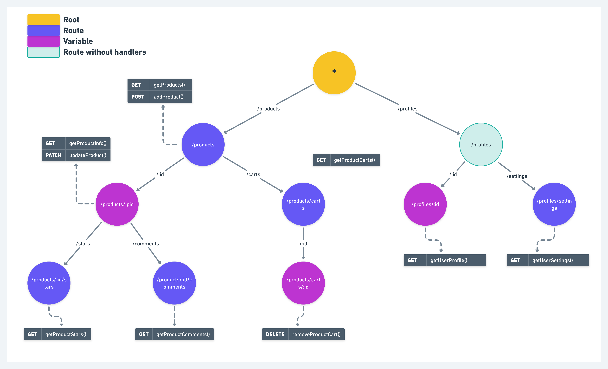

# mux

Mux is an HTTP request multiplexer (HTTP Router). 
It matches the URL of each incoming request against a list of registered 
patterns and calls the handler for the pattern that matches the URL.

In contrast to the [default mux](https://pkg.go.dev/net/http#ServeMux) of Go's net/http package, 
this Mux supports variables in the routing pattern and matches against 
the request method. It also scales better and compatible with Go's [http.Handler](https://pkg.go.dev/net/http#Handler).

This Mux is very simple, basically this Mux only aims to store and search 
for handlers based on method and path patterns.

## Quick Start

```shell
go get github.com/josestg/mux
```

### Usages

```go
package main

import (
	"fmt"
	"io"
	"log"
	"net/http"

	"github.com/josestg/mux"
)

func main() {
	m := mux.New()

	m.HandleFunc(http.MethodGet, "/hello", hello)
	m.HandleFunc(http.MethodGet, "/hello/:name", helloWithVars)

	log.Fatal(http.ListenAndServe("0.0.0.0:8080", m))
}

func hello(w http.ResponseWriter, _ *http.Request) {
	io.WriteString(w, "Hello, World\n")
}

func helloWithVars(w http.ResponseWriter, r *http.Request) {
	vars := mux.GetVars(r.Context())
	msg := fmt.Sprintf("Hello, %s\n", vars.Get("name"))
	io.WriteString(w, msg)
}
```


## How does it work?

The router relies on a Trie (Prefix Tree) data structure. Each handler is stored in a specific location which can be 
reached using path and method pairs. 

Unlike Trie in general, each child of Trie contains one character from a word. 
In this Trie, each child stores one segment of a path. 
For example the path `/ab/cd/e` has three segments namely `/ab`, `/cd`, `/e`.

### Example
Suppose we have a list of method pairs, urls, and handlers as in the following
table.

| Method  | Path                    | Handler              |
|:-------:|:------------------------|:---------------------|
 |   GET   | 	/products              | 	getProducts()       |
|  GET	   | /products/:id           | 	getProductInfo()    |
|  POST	  | /products	              | addProduct()         |
| PATCH	  | /products/:id	          | updateProduct()      |
|  GET	   | /products/:id/stars	    | getProductStars()    |
|  GET	   | /products/:id/comments	 | getProductComments() |
|  GET	   | /products/carts	        | getProductCarts()    |
| DELETE	 | /products/carts/:id     | 	removeProductCart() |
|  GET	   | /profiles/:id	          | getUserProfile()     |
|  GET	   | /profiles/settings      | 	getUserSettings()   |

When the handler is registered into Mux, it will logically form a Trie data
structure as shown in the image below.



> Notes:
> 
> `:<var-name>` (ex. `:id`) indicates that the segment is a variable. 
> That means, `/products/123/stars` and `/products/abc/stars` will match with 
> `/products/:id/stars` where the `id` values are __"123"__ and __"abc"__.